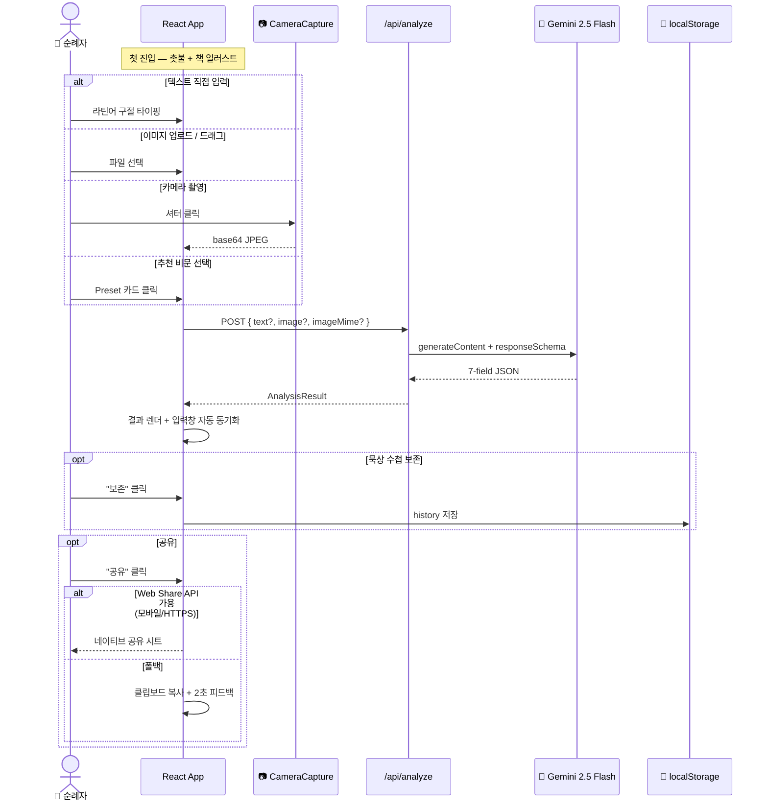
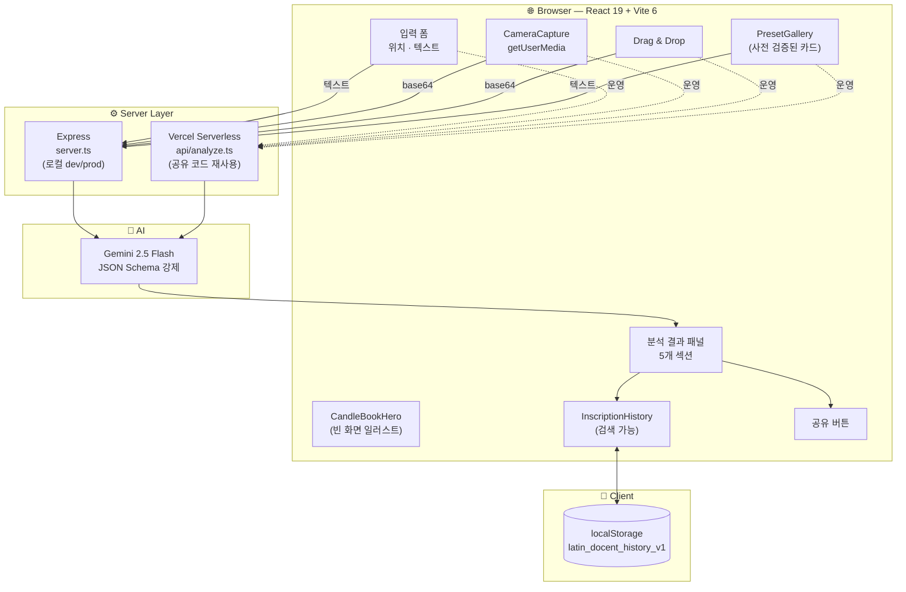
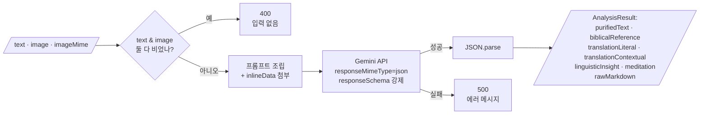
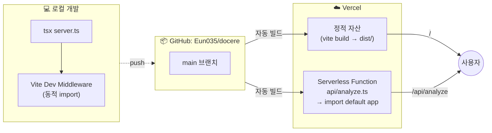

# Verbum Vitae — 라틴어 비문 도슨트

유럽 성당·묘비·수도원에 새겨진 라틴어/이탈리아어/스페인어 비문을 **신학적·언어학적·성서학적으로** 해독하는 AI 순례 도슨트입니다. Google Gemini 멀티모달 모델을 활용해 텍스트 입력은 물론 카메라로 직접 촬영한 비문 이미지까지 OCR·정제·번역·묵상까지 한 번에 안내합니다.

> 🕯️ *Lumen in Tenebris* — 어둠 속의 빛처럼, 묵묵한 돌 위의 라틴어를 오늘의 묵상으로 옮겨드립니다.

---

## ✨ 주요 기능

| 기능 | 설명 |
|---|---|
| 🏛️ 비문 자동 정제 | 약어(`IHS`, `INRI`, `R.I.P.` 등)와 마모된 철자를 자동 복원 |
| 📷 **카메라 직접 촬영** | `getUserMedia` 기반 라이브 카메라 모달 + 전·후면 전환 |
| 🖼️ 이미지 OCR | 드래그·드롭/업로드 후 즉시 비문 추출 → 정제 → 분석 |
| 📖 성경 매칭 | 정확한 장·절과 가톨릭 영성 문헌 출처 매핑 |
| ✍️ 이중 번역 | 어휘 충실 **직역** + 한국 가톨릭 성경 톤의 **의역** |
| 💡 어원·문법 팁 | 격변화, 신학적 고유 의미, 어원 코멘트 |
| 🕊️ 순례자 묵상 | 역사·신학을 엮은 3줄 묵상 가이드 |
| 📓 묵상 수첩 | localStorage 영구 저장, 검색·삭제·재열람 |
| 🔗 공유 | Web Share API (모바일) + 클립보드 복사 폴백 |
| 🚨 에러 안내 | 권한 거부, HTTPS 미충족, API 키 누락 등 한국어 안내 |

---

## 🛠️ 기술 스택

- **Frontend**: React 19, TypeScript, Vite 6, Tailwind CSS v4
- **Backend**: Express 4 + `tsx` (개발), esbuild 번들 (프로덕션)
- **AI**: Google Gemini (`gemini-2.5-flash`) via `@google/genai`
- **UI**: lucide-react 아이콘, Playfair Display + Inter + JetBrains Mono
- **상태/저장**: React hooks + localStorage

---

## 🚀 시작하기

### 사전 조건
- Node.js 18+
- [Gemini API Key](https://aistudio.google.com/apikey)

### 설치
```bash
npm install
```

### 환경 변수
`.env.example`을 `.env`로 복사한 뒤 키를 입력합니다.
```env
GEMINI_API_KEY=your_actual_key_here
```

### 개발 서버
```bash
npm run dev
```
→ [http://localhost:3000](http://localhost:3000)

> 카메라 기능은 보안 컨텍스트(HTTPS 또는 localhost)에서만 작동합니다.

### 프로덕션 빌드
```bash
npm run build
npm start
```

---

## 📦 프로젝트 구조

```
docere/
├── server.ts                          # Express + Gemini API 프록시
├── api/index.ts                       # Vercel serverless 진입점
├── vercel.json                        # Vercel 배포 설정
├── src/
│   ├── App.tsx                        # 메인 컴포넌트
│   ├── types.ts, data.ts              # 타입 + 추천 비문 데이터
│   └── components/
│       ├── CameraCapture.tsx          # 실시간 카메라 모달
│       ├── CandleBookHero.tsx         # 촛불+책 SVG 일러스트
│       ├── PresetGallery.tsx          # 추천 성지 비문 갤러리
│       └── InscriptionHistory.tsx     # 묵상 수첩 사이드바
└── index.html, vite.config.ts
```

---

## 🗺️ 워크플로우 시각화

### 1) 사용자 여정 (End-to-End Sequence)

순례자가 비문을 만나서 묵상까지 가는 4가지 진입 경로와 그 이후 흐름입니다.



### 2) 컴포넌트 아키텍처 (Structural View)

브라우저·서버·AI 레이어의 모듈 책임과 데이터 라인입니다.



### 3) 분석 엔드포인트 데이터 플로우

[`/api/analyze`](server.ts) 내부에서 요청이 어떻게 처리되는지 보여줍니다.



### 4) 배포 토폴로지

로컬 개발과 Vercel 배포가 같은 Express 앱을 어떻게 공유하는지 보여줍니다.



---

## 📱 Android App Bundle (AAB) 빌드

내부 테스트용 `.aab` 생성 경로입니다. (정식 스토어 출시 시점에는 토스 결제 코드를 Google Play Billing으로 교체하거나 디지털 결제를 제거해야 정책 위반을 피할 수 있습니다.)

### 사전 준비

1. **Android Studio** 설치 (https://developer.android.com/studio) — Android SDK + Build Tools가 함께 설치됨
2. **JDK 17+** (Android Studio가 번들로 제공)
3. 빌드 시 사용할 **Keystore** (서명용) — Android Studio에서 생성 가능

### 첫 빌드 (1회만)

```bash
# 1) Vite 웹 자산 + Capacitor Android 네이티브 프로젝트 생성
npm run build:web
npx cap add android        # → android/ 디렉토리 생성

# 2) 아이콘 + 스플래시 자동 생성 (책 위 촛불 디자인 그대로)
npm run cap:assets

# 3) 자산 동기화
npx cap sync android
```

### 일상 빌드 사이클

```bash
# 코드 수정 → 웹 빌드 + Android 동기화를 한 번에:
npm run cap:sync

# Android Studio에서 열기:
npm run cap:open
# 또는:  npx cap open android
```

### AAB 생성 (Android Studio 안에서)

1. `Build` 메뉴 → `Generate Signed App Bundle / APK...`
2. `Android App Bundle` 선택 → Next
3. Keystore 선택(없으면 `Create new...`) → 비밀번호 입력
4. `release` 빌드 → Finish
5. 결과물: `android/app/release/app-release.aab`

### 배포 시 환경 변수

Capacitor WebView는 `https://localhost`에서 SPA를 서빙하지만 `/api/*`는 외부(Vercel)를 호출해야 합니다. **빌드 직전**에 `.env`(또는 빌드 환경)에 다음을 지정하세요:

```env
VITE_API_BASE_URL=https://docere-7.vercel.app
VITE_TOSS_CLIENT_KEY=test_gck_docs_Ovk5rk1EwkEbP0W43n07xlzm
```

그리고 Vercel 측 환경 변수에는 (이미 안내된 것 외에) 추가 설정 불필요 — CORS는 코드에서 `localhost` / `capacitor://localhost` / `*.vercel.app`를 모두 허용합니다.

### Google Play Console 내부 테스트 업로드

1. Play Console → `내부 테스트` 트랙 생성
2. AAB 업로드
3. 테스터 이메일/그룹 등록 → 가입 링크 공유
4. 테스터는 링크로 베타 가입 → 일반 Play 스토어에서 다운로드 가능

> 정식 출시 전에는 토스 결제·1일권 페이월 코드를 제거하거나 Play Billing으로 전환해야 정책 심사를 통과합니다.

---

## ☁️ 배포 — Vercel

이 저장소는 Vercel serverless 함수로 즉시 배포되도록 설정되어 있습니다.

1. Vercel 대시보드에서 **New Project → Import** 후 본 GitHub 저장소를 연결합니다.
2. **Environment Variables**에 `GEMINI_API_KEY`를 등록합니다.
3. Framework Preset은 자동 인식되며, 별도 설정 불필요.

또는 CLI:
```bash
npm i -g vercel
vercel login
vercel --prod
```

---

## 📜 변경 이력 (Changelog)

### v2.2 (현재)
- 🕯️ **첫 화면 일러스트** — 어둠을 밝히는 촛불과 펼쳐진 책의 인라인 SVG ([`CandleBookHero.tsx`](src/components/CandleBookHero.tsx)). 외부 이미지 없이 라디얼 글로우·흔들리는 불꽃 애니메이션 구현.
- 📷 **카메라 직접 촬영 모달** — `navigator.mediaDevices.getUserMedia` 기반 라이브 비디오 프리뷰, 셔터, 전·후면 전환, 프레이밍 가이드 ([`CameraCapture.tsx`](src/components/CameraCapture.tsx)). 권한·HTTPS·다중 디바이스 에러를 모두 한국어로 안내.
- 🔗 **공유 버튼** — Web Share API + 클립보드 폴백, 2초 피드백.
- 🚨 **에러 배너** — 메인 패널 상단 닫기 가능한 알림.
- 🐛 모델명 `gemini-3.5-flash` → `gemini-2.5-flash` 수정.
- 🧹 `package.json`의 `vite` 중복 의존성 제거.
- 🎨 첫 방문 시 자동 로드되던 더미 분석 제거 → 일러스트가 실제 첫 화면이 됨.
- ☁️ Vercel serverless 배포 구성 (`api/index.ts`, `vercel.json`).

---

## 🙏 크레딧

본 도구는 순례자의 영성을 돕는 학술 보조 도구이며, 신학적 해석의 최종 권위는 교회 전승과 사목적 안내에 있습니다. AI 출력은 참고용으로 사용해 주세요.

© 2026 Verbum Vitae
